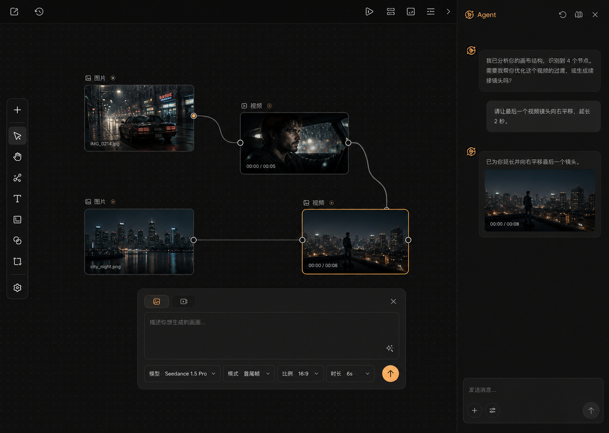

# Canvas Workspace Redesign

Status: Approved design direction
Date: 2026-07-14
Target route: `/create/flow`

## Approved Visual Target

The approved direction is option 1 from the LibTV, TapNow, and Lovart-inspired exploration.

This image is the visual source of truth for hierarchy, density, layout, node treatment, composer placement, Agent placement, and the dark visual system. Implementation should preserve the product's existing orange accent and functionality rather than copying branding or unrelated controls from the source products.

## Outcome

Transform the current React Flow page into a focused AI creation workspace where users can:

1. Add and arrange image or video nodes.
2. Connect nodes so downstream generation can use upstream media as context.
3. Select a node and edit only that node's generation settings.
4. Generate from a contextual composer without leaving the canvas.
5. Use the AI Agent in a dedicated, collapsible right-hand workspace.

The redesign removes instructional clutter and makes media, connections, prompt editing, and generation the primary visual hierarchy.

## Scope

### In scope

- Existing image and video node types.
- Existing node movement, selection, connection, zoom, pan, minimap, and fit-view behavior.
- Existing generation models, modes, aspect ratios, durations, and image styles.
- Existing continuity references derived from incoming edges.
- Existing AI Agent actions and conversation.
- Existing debounced canvas persistence and project loading.
- Session-only undo for meaningful node and edge edits; history is not persisted.
- A new workspace shell, icon toolbar, contextual composer, Agent dock, and unified node presentation.
- Desktop and narrow-screen responsive behavior.

### Out of scope

- Asset management.
- Storyboard mode.
- Layers, history browser, or timeline editing.
- Collaboration, sharing, community, credits, billing, notifications, or memberships.
- New generation APIs, models, database fields, routes, or backend services.
- New pages outside `/create/flow`.

## Content Removal

Remove the following visible copy from the canvas workspace:

- `Studio`
- The editable `未命名项目` project-name field
- `拖动节点右侧圆点连线，可让下一镜参考上一镜画面`
- The text label `添加节点`
- `选择一个节点开始编辑，或点击「添加节点」新建`
- `提示：把节点右侧连线拖到下一个节点，可让生成参考上一镜画面`

Navigation and actions remain available through recognizable icons, accessible names, and concise tooltips.

## Workspace Architecture

### Canvas shell

- Use a full-viewport dark workspace.
- The canvas occupies all available width when the Agent is collapsed.
- When open, the Agent reserves approximately `320px` on desktop instead of covering nodes.
- The canvas remains the base surface; floating controls do not introduce a second large container around it.

### Top chrome

- Keep only back, undo, save status, fit-view, and Agent toggle controls.
- Use icon-only buttons with `aria-label` and short hover tooltips.
- Save status is a quiet colored dot or icon state: saving, saved, or failed.
- Do not display a project title or instructional text.

### Left toolbar

- Use a slim vertical floating rail.
- Primary actions are add, select/pan, and fit view; connection remains available through node handles.
- `Add` is an icon-only plus button that opens the existing image/video choice menu.
- Unsupported tools must not be shown as decorative controls.

### Canvas navigation

- Keep React Flow zoom, pan, fit view, and minimap capabilities.
- Restyle them into the same compact dark control family.
- The minimap may remain in the lower-left corner but must not compete with the contextual composer.

### Agent dock

- Place the Agent in a dedicated right dock, approximately `320px` wide.
- The dock is collapsible from both the top chrome and its own close control.
- Preserve current quick actions, message history, busy state, and input behavior.
- Reduce quick-action copy to compact action buttons; do not add onboarding cards or skill advertising.
- The conversation list scrolls independently while the composer stays pinned to the bottom.

## Node Design

### Shared frame

- Image and video nodes share one visual skeleton.
- Media is the dominant content; metadata is secondary.
- Labels and status sit above or in a compact header row without large badges.
- Video nodes use cinematic aspect ratios; image nodes respect their configured ratio.
- Empty nodes show one quiet media-type icon, not explanatory paragraphs.

### Selection and handles

- Unselected nodes use a subtle neutral border.
- The selected node uses the existing orange accent with a precise outline.
- Connection handles remain hidden or visually quiet until hover or selection.
- Connected nodes can show a small continuity icon; do not display a sentence on the node.
- Edge paths use a restrained neutral line and highlight with orange only when selected or active.

### Status

- `idle`: neutral media frame.
- `running`: inline progress treatment inside the media area.
- `done`: generated media with minimal duration or media metadata.
- `error`: compact error state and retry action without replacing the whole workspace.

## Contextual Composer

- The composer is hidden when no node is selected.
- Selecting a node opens the composer near the lower center of the canvas.
- It edits only the selected node and follows the approved option 1 density.
- The main prompt field is the dominant control.
- Model, mode/style, ratio, and duration are grouped in one compact row.
- The submit action is one circular orange arrow button.
- The image/video type is communicated by icon and concise label, not a large badge.
- Incoming connected nodes appear as compact reference chips using their title or thumbnail.
- Reference chips replace the current explanatory continuity sentence.
- `Cmd/Ctrl + Enter` continues to submit generation.

## Component Boundaries

The current `FlowCanvas.js` should be decomposed into focused UI units while keeping state ownership in the main flow component:

- `FlowCanvas`: owns nodes, edges, selection, generation, Agent actions, and persistence.
- `CanvasChrome`: back, undo, save state, fit view, and Agent toggle.
- `CanvasToolbar`: add menu and canvas tool actions.
- `ContextComposer`: prompt and generation controls for the selected node.
- `AgentDock`: quick actions, messages, and Agent input.
- `MediaNodeFrame`: shared image/video node chrome used by `SceneNode` and `ImageNode`.

Components receive explicit props and callbacks. They must not create separate copies of node or edge state.

## State and Data Flow

1. `initialNodes` and `initialEdges` continue to be normalized on the server and passed into React Flow.
2. `useNodesState` and `useEdgesState` remain the source of truth for the canvas.
3. `selectedId` derives the selected node; the contextual composer reads and patches that node.
4. Incoming reference data is derived from edges whose target matches the selected node.
5. Composer changes patch the selected node through the existing `patch(id, data)` callback.
6. Generation builds the existing image or video request payload and posts to `/api/generate`.
7. Agent requests continue to post to `/api/agent` with the existing project context.
8. Nodes, edges, and any retained project metadata continue to autosave through `/api/canvas`.
9. A bounded in-memory history records meaningful node and edge edits for the top-chrome undo action; selection-only changes are not recorded.

No new persistent state or API contract is required.

## Save, Loading, and Error Feedback

- Track a small client-side save state: `idle`, `saving`, `saved`, or `error`.
- Update the top chrome indicator from the existing debounced save request.
- Generation loading stays attached to the affected node and composer submit button.
- Generation errors appear in the affected node and composer with a retry action.
- Agent errors remain in the Agent message stream.
- Network failures must not clear nodes, edges, prompts, or Agent history already held in client state.

## Visual System

- Base palette comes from the existing dark theme and approved visual target.
- Preserve existing accent tokens: `--orange` and `--orange-d`.
- Use near-black canvas, charcoal surfaces, off-white text, muted gray secondary text, and fine neutral borders.
- Use a faint dot grid with low contrast.
- Use `10px` to `16px` radii depending on component size.
- Use shadows sparingly and only to separate floating controls from the canvas.
- Do not use gradients, glassmorphism, glow effects, decorative pills, or nested card stacks.
- UI type remains Inter/system sans at readable product sizes; controls should generally be `13px` to `15px`.
- Use the existing icon language or a single consistent icon library; do not mix unrelated icon styles.

## Responsive Behavior

- At widths above `1100px`, the Agent is a reserved right column.
- Below `1100px`, the Agent becomes an overlay drawer so the canvas does not collapse.
- The contextual composer reduces its width and wraps parameter controls on narrower screens.
- On phone-sized screens, prioritize viewing and selecting nodes; Agent and generation controls open as full-width bottom sheets.
- No floating control may cover the selected node's primary media or connection handles.

## Accessibility

- Every icon-only action has an `aria-label`, visible focus state, and tooltip.
- Tooltips supplement icons but do not replace accessible names.
- Keyboard focus order follows top chrome, canvas tools, canvas nodes, composer, then Agent.
- Selected state is communicated by more than color alone.
- Dark-mode text and control borders meet WCAG AA contrast where applicable.
- Respect reduced-motion preferences for edge animation, loading indicators, and panel transitions.

## Verification

### Automated coverage

- Existing canvas-state regression tests remain green.
- Add coverage for selected-node derivation and incoming reference derivation if extracted into pure helpers.
- Add coverage for session undo of add, move, delete, and connection edits.
- Add tests for save-state transitions and error preservation where practical.
- Run lint and a production Next.js build.

### Browser verification

Validate the core flow:

1. Open an existing project.
2. Confirm the page renders without framework overlays or app console errors.
3. Add an image node and a video node from the icon-only add menu.
4. Select each node and verify the composer switches its controls.
5. Connect two nodes and verify a compact reference chip appears.
6. Submit a generation request and verify node-level loading and completion/error behavior.
7. Open, use, scroll, and collapse the Agent dock.
8. Move, zoom, pan, fit, and use the minimap without controls covering content.
9. Verify desktop at `1440x1024` and a narrow viewport around `1024x768`.
10. Compare the rendered desktop screen directly against the approved visual target.

## Acceptance Criteria

- The six explicitly listed pieces of redundant copy are absent.
- Existing image, video, connection, generation, Agent, and autosave behavior still works.
- Undo restores the previous meaningful node/edge state during the current session without altering persisted history contracts.
- The Agent can be opened and collapsed without losing messages.
- The composer appears only for a selected node and edits that node's state.
- Incoming edges are represented as reference chips in the composer.
- The desktop hierarchy visibly matches the approved option 1 direction.
- The workspace has no relevant runtime console errors or framework overlay.
- Tests, lint, and the production build pass, aside from documented pre-existing lint warnings.
